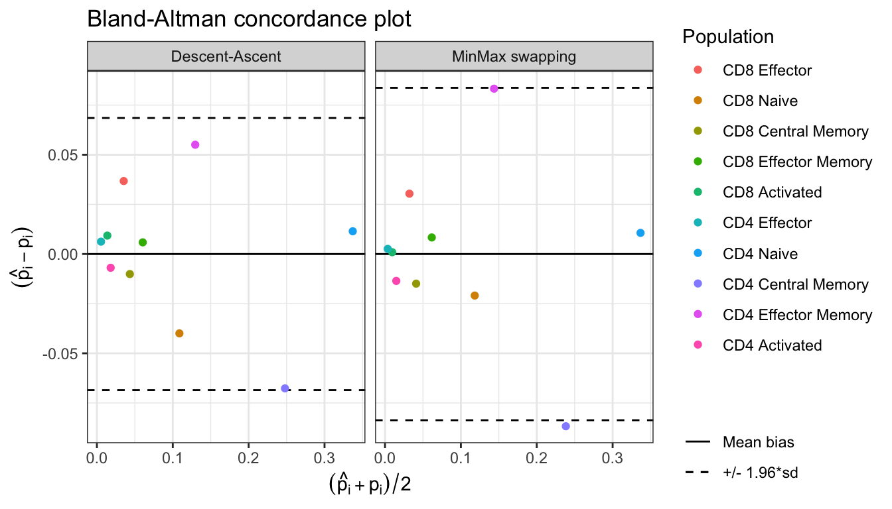

<!-- README.md is generated from README.Rmd. Please edit that file -->

# `CytOpT` <a></a>

<!-- badges: start -->

[](https://github.com/sistm/CytOpt-R/actions)
[](https://app.codecov.io/gh/sistm/CytOpT-R?branch=main)
[](https://CRAN.R-project.org/package=CytOpT)
<!-- badges: end -->

`CytOpT` uses regularized optimal transport to directly estimate the
different cell population proportions from a biological sample
characterized with flow cytometry measurements.

## Overview

`CytOpT` is an `R` package that provides a new algorithm relying
regularized optimal transport to directly estimate the different cell
population proportions from a biological sample characterized with flow
cytometry measurements. Algorithm is based on the regularized
Wasserstein metric to compare cytometry measurements from different
samples, thus accounting for possible mis-alignment of a given cell
population across sample (due to technical variability from the
technology of measurements).

The main function of the package is `CytOpT()`.

The methods implemented in this package are detailed in the following
article:

> Paul Freulon, Jérémie Bigot, Boris P. Hejblum. CytOpT: Optimal
> Transport with Domain Adaptation for Interpreting Flow Cytometry data
> <https://arxiv.org/abs/2006.09003>

## Installation

You can install and load `CytOpT` into `R` from
[`CRAN`](https://CRAN.R-project.org/package=CytOpT) with the following
commands:

``` r
install.packages("CytOpT")
library(CytOpT)
```

Alternatively, you can install the development version of CytOpT like
so:

``` r
remotes::install_github("sistm/CytOpT-R")
library(CytOpT)
```

## Example

This is a basic example of `CytOpt` usage:

### Data import

``` r
library(CytOpT)
# Load source Data
data("HIPC_Stanford")
```

``` r
# Define the true proportions in the target data set
gold_standard_manual_prop <- c(table(HIPC_Stanford_1369_1A_labels)/length(HIPC_Stanford_1369_1A_labels))
```

### Proportion estimations using *optimal transport* and *minmax swapping* procedures

``` r
# Run CytOpt and compare the two optimization methods
res <- CytOpT(X_s = HIPC_Stanford_1228_1A, X_t = HIPC_Stanford_1369_1A, 
              Lab_source = HIPC_Stanford_1228_1A_labels,
              theta_true = gold_standard_manual_prop,
              eps = 0.0001, lbd = 0.0001, n_iter = 10000, n_stoc=10,
              step_grad = 10, step = 5, power = 0.99, 
              method='both', monitoring=TRUE)
#> Running Desent-ascent optimization...
#> Done in 1.1 mins
#> Running MinMax optimization...
#> Done in 17.7 secs
```

``` r
summary(res)
#> Estimation of cell proportions with Descent-Ascent and MinMax swapping from CytOpt:
#>                     Gold_standard Descent_ascent      MinMax
#> CD8 Effector          0.017004001     0.05453731 0.045075672
#> CD8 Naive             0.128736173     0.08928331 0.098249477
#> CD8 Central Memory    0.048481996     0.03773986 0.037042809
#> CD8 Effector Memory   0.057484114     0.06401477 0.067066526
#> CD8 Activated         0.009090374     0.01799109 0.013237704
#> CD4 Effector          0.002324076     0.00836774 0.004478523
#> CD4 Naive             0.331460344     0.35235646 0.350022651
#> CD4 Central Memory    0.281713344     0.19980412 0.209094239
#> CD4 Effector Memory   0.102082843     0.16089777 0.167157940
#> CD4 Activated         0.021622735     0.01500757 0.008574457
#> 
#> Final Kullback-Leibler divergences:
#>  Descent-Ascent MinMax swapping 
#>      0.07194681      0.05692023
```

``` r
plot(res)
```


``` r
Bland_Altman(res$proportions)
```


